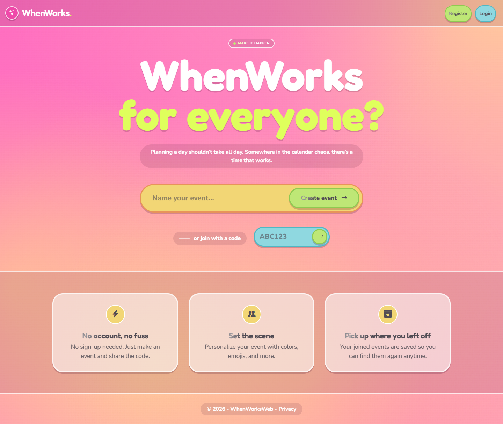
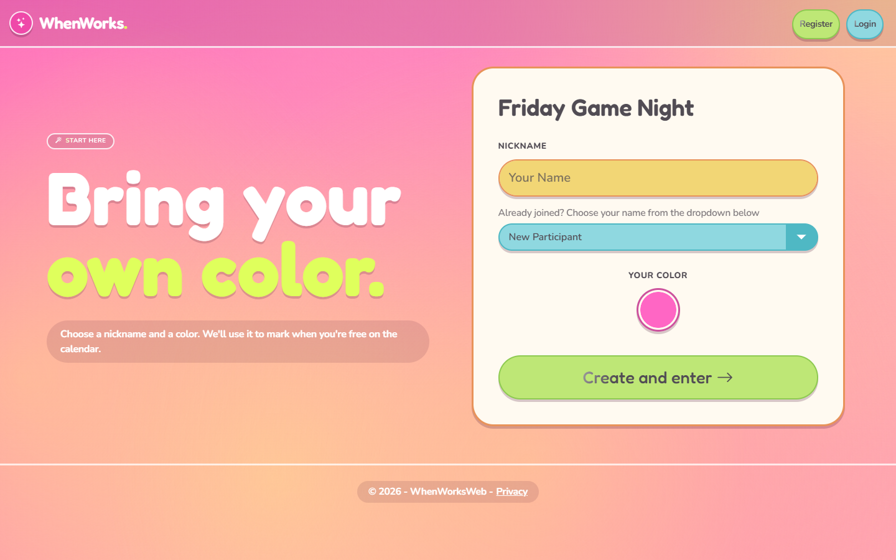
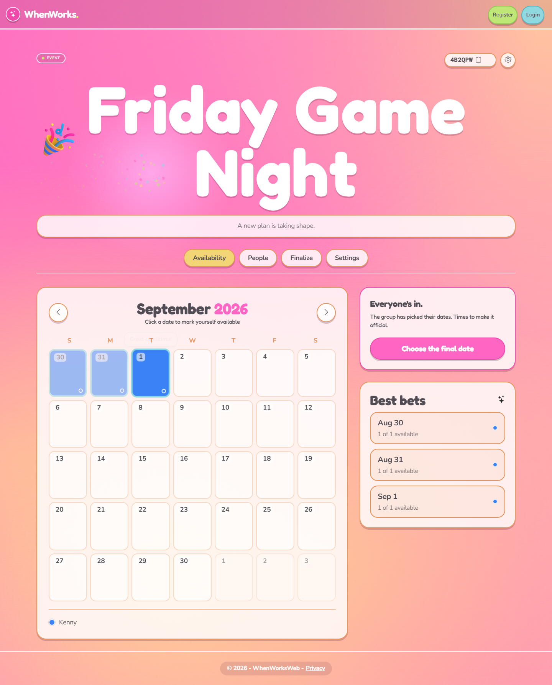
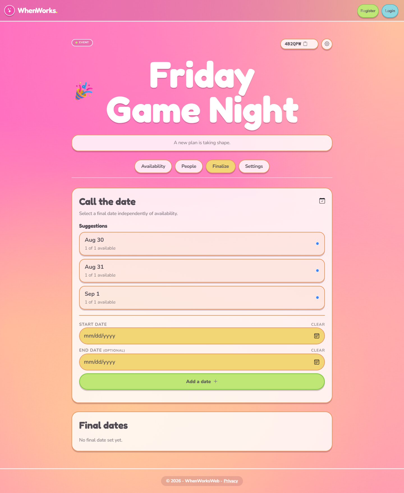
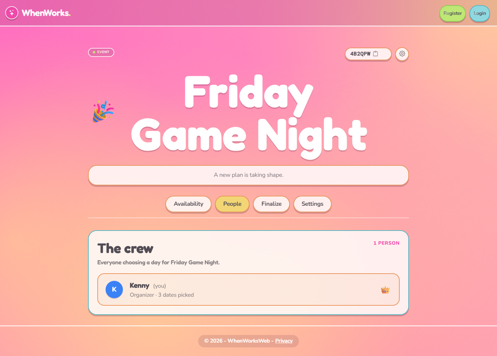
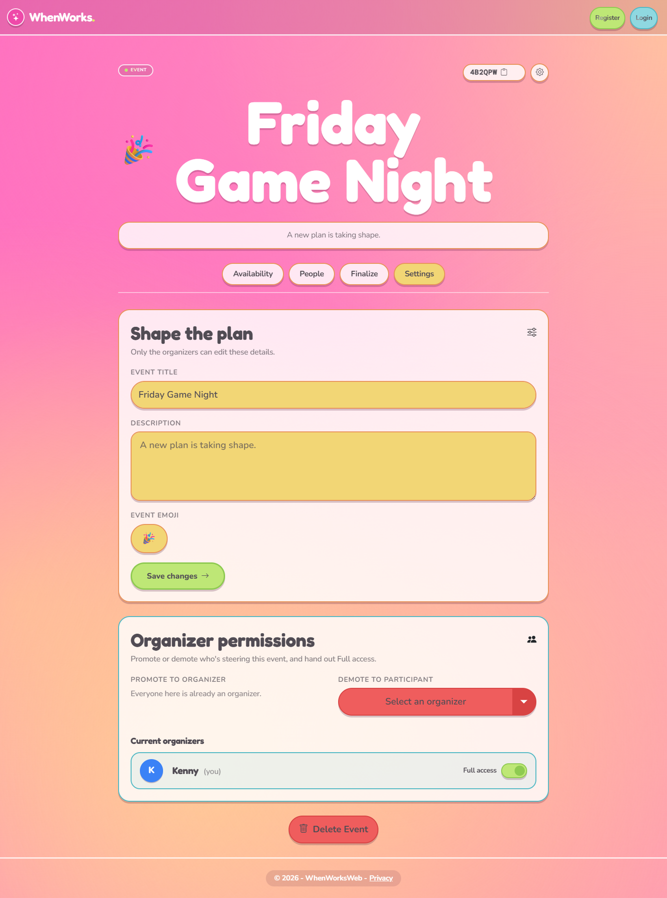
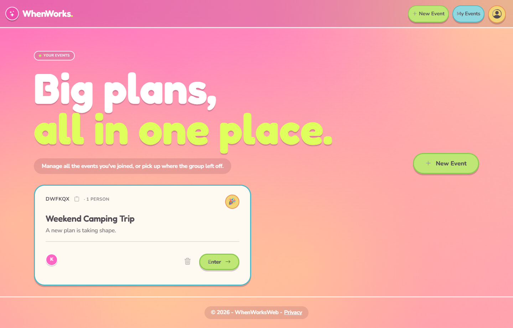

# WhenWorks

WhenWorks is a web application that helps groups coordinate availability for events. Create an event, share the code, and everyone marks the dates that work for them on a shared calendar — no account required to join.

---

## Implemented Features

- **Event Creation and Access**
  - Create a new event and get a shareable event code
  - Join an existing event using that code

- **Participant Sign-In**
  - Enter a new display name or select an existing participant
  - Choose a personal color used for your calendar selections

- **Availability Calendar**
  - Click dates to toggle your own availability
  - Each participant's selections appear in their chosen color
  - Best-bets ranking surfaces the dates with the most availability

- **Finalize**
  - "Call the date" suggestions drawn from the availability calendar
  - Organizers can lock in one or more final dates for the event

- **People**
  - Paginated participant roster, organizers listed first, then alphabetically

- **Organizer Permissions**
  - Promote or demote organizers
  - Grant/revoke an organizer's ability to manage other organizers
  - Safeguards against demoting the last remaining organizer

- **Event Settings**
  - Edit the event's title, description, and emoji
  - Delete the event

- **My Events Page**
  - View every event you've joined
  - Jump back into an event or delete it from your list

---

## Planned Features

- **Chat System**
  - Send and view messages within an event

---

## Gallery

*Screenshots of the application in action:*

*Event creation and landing page*


*Event sign-in page*


*Availability calendar*


*Finalize tab*


*People roster*


*Event settings*


*My Events dashboard*


---

## Tech Stack

| Area | Technology |
|------|------------|
| Backend | C# with ASP.NET Core MVC (.NET 10) |
| Frontend | Razor views, Bootstrap 5, vanilla JavaScript |
| Data Access | Entity Framework Core (code-first) |
| Authentication | ASP.NET Core Identity |
| Database | SQL Server |
| Version Control | Git & GitHub |

---

## Running Locally

**Prerequisites**
- [.NET 10 SDK](https://dotnet.microsoft.com/download)
- SQL Server — LocalDB (bundled with Visual Studio) works out of the box; a full SQL Server instance works too, just update the connection string
- The EF Core CLI tools, if you don't already have them: `dotnet tool install --global dotnet-ef`

**Steps**

```bash
# Clone the repo
git clone https://github.com/Kenny-42/WhenWorksWeb
cd WhenWorksWeb/WhenWorksWeb

# Apply database migrations (creates the local database)
dotnet ef database update

# Run the app
dotnet run
```

The app starts on the URL printed in the console (see `Properties/launchSettings.json`). Open it in a browser to create or join an event — no account is required to try the core flow; registering an account is only needed to use the My Events dashboard.

If you're not on Windows or don't have LocalDB, update the `DefaultConnection` string in `appsettings.json` (or `appsettings.Development.json`) to point at your own SQL Server instance before running the migration.

---

## Project Status

Currently in active development. Features, architecture, and implementation details may evolve as development progresses.
